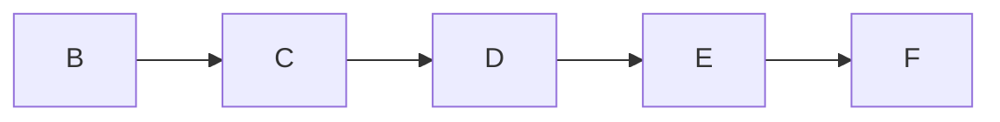

# 二叉树

## 1.二叉树的概念

## 2.二叉树

### 1.链表的原理

- 链表是通过指针或者引用来把物理上，即内存中并不相邻的两个或者多个元素连接起来。在逻辑上，内存中不相邻的数据在逻辑上相邻
- 数组这种是通过物理地址来把在物理上，即内存中相邻的两个或者多个元素连接起来，在物理和逻辑上，数据都是相邻的。
- 数组是一片连续的内存，所里有点就是，可以根据物理地址，来快速的访问，缺点就是，想要在某个位置插入一条数据，那么这个位置之后的数据都需要移动，空出位置来，才能插入，存在数据的大量移动。
- 链表的有点就是，表示数据的内存是不连续的，所以删除，增加某个数据，不要大量移动数据，缺点就是，不能像数组那样通过物理地址的加减运算来得到数据的位置

---

